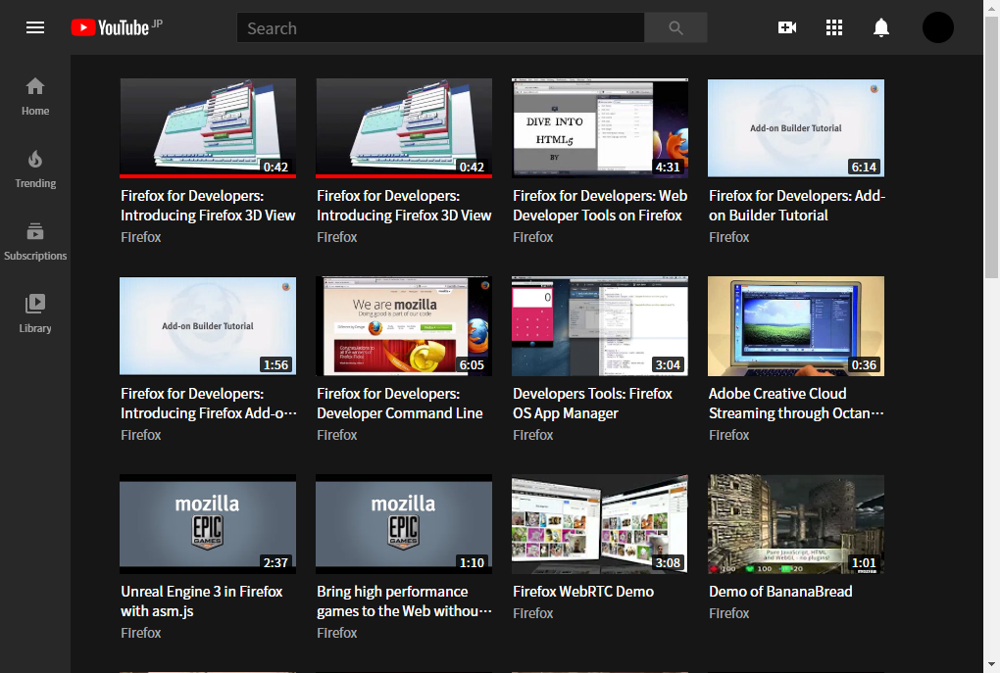

# YouTube Grid Layout

**YouTube Grid Layout** is a extension for web browsers. 
This extension makes [YouTube](https://www.youtube.com/) display in grid layout, and you will be able to access and find the videos which you want to watch much more easily. 
In addition, you can change the **thumbnail size**, **the space among the thumbnails**, and **font size**. 
This extension runs at **Home(https://www.youtube.com/)**, **Playlist(for example : https://www.youtube.com/playlist?list=example)** and **search result page(for example : https://www.youtube.com/results?search_query=example)** 
**(These urls are examples!)**

## Synchronization of settings
If you change settings while you are opening greater than or equal to two tabs on YouTube, All the tab's settings will be synchronized. 
However, You cannot synchronize your settings among different terminals. (for example, among your computers and smartphones)

## Browser support
This extension has two versions. *Chromium-based version*, and *Mozilla-Firefox version*.

### *Chromium-based version*
You can use this version if you are using Chromium-based browsers such as Google Chrome,  Microsoft Edge, Opera, Vivaldi and every other browsers in which you can install chrome extensions.

### *Mozilla-Firefox version*
You can use this version if you are using Mozilla Firefox.

## Language support
You can use this extension in English and Japanese.

This README is written considering you use [**Google Translate**](https://translate.google.com/) if you cannot read English. If you cannot understand what this README's meanings, Please let me know the problem.

---------------------------------------

## Authors
NumLocker (https://github.com/NumLocker-081)

## Credits
**YouTube Grid Layout** was made using the following open source project.

### WebExtension browser API Polyfill
https://github.com/mozilla/webextension-polyfill#contributing-to-this-project

## License
*Copyright (c) 2020 NumLocker* 
Released under the MIT license 
https://opensource.org/licenses/mit-license.php